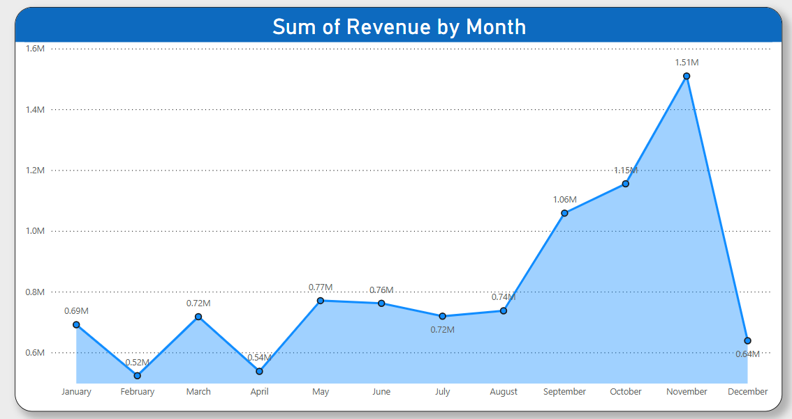
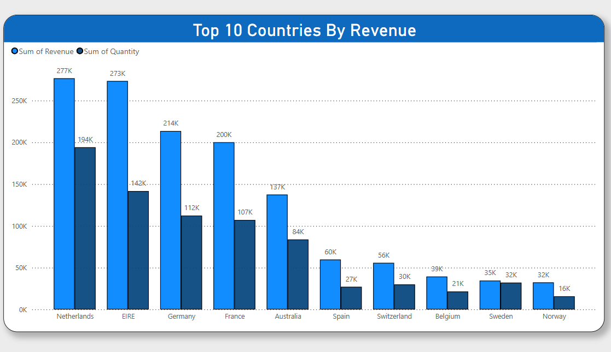

# Retail Performance Analysis & Strategic Recommendations

## Dictionary
- **Revenue Growth**: Increase in revenue over time, a key metric for business success ([Business Success Metrics](https://asana.com/resources/success-metrics-examples)).
- **Customer Retention**: Strategies to maintain relationships with high-value customers ([Business Success Metrics](https://asana.com/resources/success-metrics-examples)).
- **Market Expansion**: Opportunities to grow into new regions or markets ([Business Success Metrics](https://asana.com/resources/success-metrics-examples)).
- **Dataset**: [Online Retail Data Set](https://view.officeapps.live.com/op/view.aspx?src=https%3A%2F%2Fcdn.theforage.com%2Fvinternships%2Fcompanyassets%2FifobHAoMjQs9s6bKS%2F5XsFFJu2oCLdmYJW2%2F1654309626143%2FOnline%2520Retail%2520Data%2520Set.xlsx&wdOrigin=BROWSELINK)

## Executive Summary
This report delivers actionable insights from the 2011 retail performance data, focusing on revenue growth, customer retention, and market expansion for the CEO and CMO. As a job simulation, the project required selecting optimal visualizations to meet the executives’ strategic needs, ensuring data-driven decisions. Key findings include seasonal revenue trends, top-performing markets and customers, and global demand opportunities, with recommendations to drive business growth.

## 1. Revenue Trends Analysis (For CEO)
### Question
Analyze the time series of revenue data for 2011 to identify seasonal trends and provide forecasting insights for revenue growth.

### Answer
The 2011 revenue data shows a fluctuating trend, starting at \$0.69M in January, dipping to \$0.52M in February, and peaking at \$1.51M in November, before declining to \$0.64M in December. The first eight months average \$0.69M, with a 40% surge in September (\$1.06M) leading to the November peak, likely due to holiday seasonality. The December drop suggests a post-holiday slump.

**Recommendations for Revenue Growth:**
- Investigate the February and December dips to address potential supply chain or competitive issues.
- Increase inventory and marketing efforts from September to November to maximize holiday-driven revenue growth.
- Implement post-holiday promotions to mitigate the December decline and enhance forecasting for 2012.

---

## 2. Top 10 Countries Performance (For CMO)
### Question
Identify the top 10 countries by revenue and quantity sold, excluding the UK, to assess market opportunities.

### Answer
Excluding the UK, the Netherlands leads with \$277K in revenue and 194K units sold, followed by EIRE (\$273K, 142K units), Germany (\$214K, 112K units), and France (\$200K, 107K units). Lower performers include Spain (\$60K, 27K units) and Norway (\$32K, 16K units). Australia (\$137K, 84K units) shows growth potential. This highlights strong European markets with opportunities for market expansion.

**Recommendations for Market Expansion:**
- Focus marketing campaigns in the Netherlands and EIRE with personalized offers to maintain market leadership.
- Optimize pricing in Germany and France to increase revenue from high sales volumes.
- Launch targeted campaigns in Australia to capitalize on growing demand and expand market presence.

---

## 3. Top 10 Customers Analysis (For CMO)
### Question
Evaluate the top 10 customers by revenue to inform customer retention and growth strategies.

### Answer
Customer 14646 generates the highest revenue at $272K, followed by 18102 at \$232K, down to 16029 at \$68K. Notably, the highest revenue-generating customer only purchased 17% more than the second-highest, indicating the business is not overly reliant on a few customers. This suggests low customer bargaining power, positioning the company favorably. The top five customers drive the majority of revenue, highlighting the importance of customer retention.

**Recommendations for Customer Retention:**
- Prioritize tailored services (e.g., exclusive discounts, dedicated support) for the top five customers to ensure retention.
- Develop targeted promotions for lower-tier customers (e.g., 14156, 16029) to boost their contribution.
- Analyze the top customer’s purchasing behavior to replicate successful strategies across the customer base.

---

## 4. Global Demand Distribution (For CEO)
### Question
Assess demand across all countries, excluding the UK, to guide market expansion strategies.

### Answer
Europe dominates demand, with the Netherlands (194K units), EIRE (142K units), and Germany (112K units) leading. Australia (84K units) and Japan (22K units) show moderate demand, while Africa (e.g., South Africa at 352 units) and Asia (beyond Japan) are minimal. This indicates a strong European base with market expansion potential in Australia, Japan, and emerging markets like Brazil (356 units).

**Recommendations for Market Expansion:**
- Expand in Europe (Netherlands, EIRE, Germany) through new branches or increased investment.
- Initiate pilot programs in Australia and Japan to test and grow demand.
- Conduct market research in Asia and South America (e.g., Brazil) to identify long-term growth opportunities.

---

## Conclusion
This analysis highlights opportunities to enhance revenue growth, strengthen customer retention, and drive market expansion. Immediate implementation of the recommended strategies will position the company for success in 2012 and beyond. As a job simulation, this project demonstrates the ability to deliver business-relevant insights through effective visualizations, meeting the needs of senior management.

## Appendix
- **Data Source:** retail performance dataset.
- **Tools Used:** Python (Pandas), Power BI for visualizations.
- **Contact:** [alliaagamall@gmail.com](alliaagamall@gmail.com).